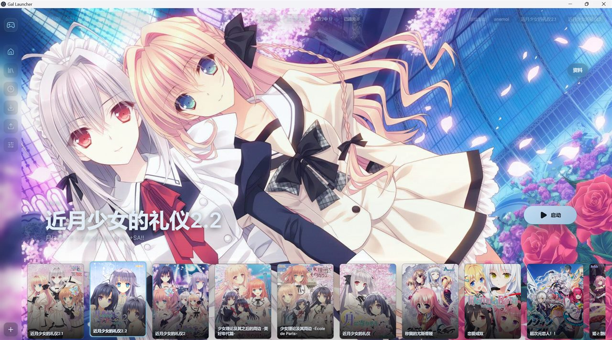
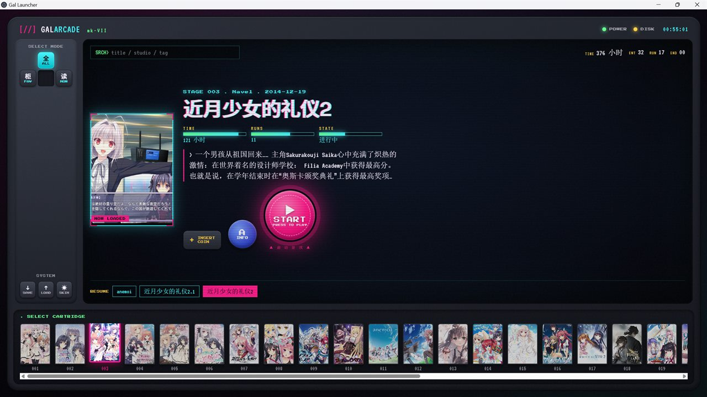
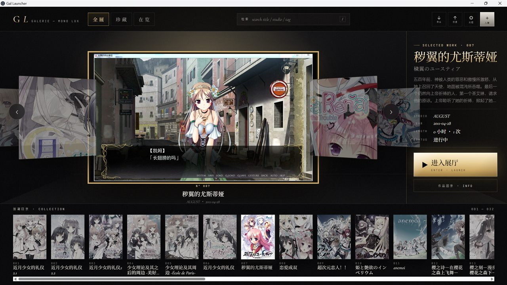

<p align="center">
  
</p>

<h1 align="center">Gal Launcher</h1>

<p align="center">
  <strong>让本地 Galgame / 视觉小说收藏也拥有漂亮、可追踪、可切换主题的启动体验。</strong>
  <br>
  <sub>A local visual novel launcher for browsing, launching, tracking, and presenting your library.</sub>
</p>

<p align="center">
  <a href="https://github.com/KamiNeko-pre/gal-launcher/releases"><strong>下载 Download</strong></a>
  ·
  <a href="docs/USER_GUIDE.md">使用教程</a>
  ·
  <a href="ROADMAP.md">路线图</a>
  ·
  <a href="docs/DATA_SOURCES.md">数据来源</a>
</p>

<p align="center">
  
  
  
  
  
</p>

> **免责声明 / Disclaimer**：Gal Launcher 不提供游戏本体、下载资源、破解、补丁或 DRM 绕过工具。它只管理你已经安装在本地的游戏。

---

## 这到底是什么？

硬盘里一堆 `game.exe`、`SiglusEngine.exe`、`start.exe`、`launcher.exe`，时间一久就很难分清哪个文件夹是哪部作品，想重温也找不到入口。

Gal Launcher 把这些本地游戏整理成一个视觉小说专用启动器：

- 给每个游戏匹配封面、横版背景、会社、发售日、标签和简介
- 从 VNDB / Bangumi / Steam 等多个来源辅助搜索资料和图片候选
- 用多套主题展示作品库，而不是只显示文件路径
- 一键启动游戏，并自动记录启动次数和游玩时长
- 数据保存在本地，支持导出备份和恢复

本质上，它是一个“本地 Galgame / 视觉小说书架”。

---

## 功能亮点

<table>
<tr>
  <td width="50%">
    <h4>本地游戏库</h4>
    <p>添加 <code>.exe</code>、<code>.bat</code>、<code>.cmd</code>、<code>.lnk</code> 启动文件，自动设置工作目录并启动游戏。</p>
  </td>
  <td width="50%">
    <h4>资料补全</h4>
    <p>搜索标题、原名、会社、简介、发售日、标签、评分和图片候选，自动识别不准时也可以手动修正。</p>
  </td>
</tr>
<tr>
  <td>
    <h4>封面与横版背景</h4>
    <p>竖版封面用于书架和收藏页，横版图用于启动页。可以从候选里选，也可以使用本地图片。</p>
  </td>
  <td>
    <h4>游玩追踪</h4>
    <p>记录启动次数、总时长、最近游玩时间、当前进行状态和会话历史。</p>
  </td>
</tr>
<tr>
  <td>
    <h4>多主题界面</h4>
    <p>六套主题拥有不同布局、导航和收藏页，不只是换颜色。</p>
  </td>
  <td>
    <h4>本地优先</h4>
    <p>游戏库数据保存在本机。支持备份导出和恢复，不依赖云同步。</p>
  </td>
</tr>
</table>

---

## 主题系统

0.3.0 之后，主题不再只是配色预设，而是完整的前端布局。每套主题都有自己的信息架构、作品导航和收藏页表达。

| 主题 | 风格 |
| --- | --- |
| **Cinema** | 沉浸式横版大图，保留最初的电影感启动语言 |
| **Editorial** | 杂志跨页、刊头工具栏、目录式分页 |
| **Arcade** | CRT 游戏机、卡带槽、像素 HUD、街机启动按钮 |
| **Atelier** | 手账桌面、相册、便签和纸张拼贴 |
| **Lumen Shelf** | 明亮书架、目录索引、多列作品墙 |
| **Aurora** | 柔光剧照舞台、续读列表和玻璃信息卡 |

<table>
<tr>
  <td width="50%"><br><strong>Cinema</strong></td>
  <td width="50%"><br><strong>Editorial</strong></td>
</tr>
<tr>
  <td width="50%"><br><strong>Arcade</strong></td>
  <td width="50%"><br><strong>Atelier</strong></td>
</tr>
<tr>
  <td width="50%"><br><strong>Lumen Shelf</strong></td>
  <td width="50%"><br><strong>Aurora</strong></td>
</tr>
</table>

---

## 快速开始

```text
1. 下载 Gal-Launcher-vX.X.X.zip
2. 解压后打开 Gal Launcher.exe
3. 点击添加按钮，选择游戏启动文件
4. 等待自动资料搜索，或手动选择候选资料
5. 点击封面进入启动页，一键启动游戏
```

支持 `exe / bat / cmd / lnk` 四种启动方式。执行目录会自动设为游戏所在文件夹。

完整教程见 [使用指南](docs/USER_GUIDE.md)。

---

## 截图画廊

<p align="center">
  
  <br>
  <em>横版主视觉启动页</em>
</p>

<p align="center">
  
  <br>
  <em>游戏详情面板：资料、时长统计和游玩记录</em>
</p>

<p align="center">
  
  <br>
  <em>封面和背景候选搜索</em>
</p>

---

## 下载与运行

前往 [Releases](https://github.com/KamiNeko-pre/gal-launcher/releases) 下载最新版本。

推荐下载 zip 包，解压后运行：

```text
win-unpacked/Gal Launcher.exe
```

如果 Windows 提示“未知发布者”，这是因为当前版本没有代码签名证书。确认文件来自本仓库 Release 后继续运行即可。

---

## 数据来源

| 来源 | 用途 | 类型 |
| --- | --- | --- |
| VNDB | 游戏资料、会社、发行日、封面和截图候选 | API |
| Bangumi | 条目搜索、评分、封面候选 | API / 网页 |
| Steam | 商店图片候选 | API |
| DLsite | 图片候选 | 网页 |
| 2DFan | 图片候选 | 网页 |
| 其他社区页面 | 可选补充候选 | 网页 |
| 本地文件 | 用户手动选择的封面和背景 | 本机 |

详见 [数据来源说明](docs/DATA_SOURCES.md) 和 [隐私说明](docs/PRIVACY.md)。

---

## 对比

| | Gal Launcher | Playnite | Steam | 手动管理 |
| --- | :---: | :---: | :---: | :---: |
| Galgame / 视觉小说资料搜索 | 是 | 插件依赖 | 否 | 否 |
| Bangumi 评分 | 是 | 否 | 否 | 否 |
| 多来源图片候选 | 是 | 插件依赖 | 否 | 否 |
| 专门为视觉小说设计的主题 | 是 | 否 | 否 | 否 |
| 本地离线可用 | 是 | 是 | 部分 | 是 |
| 开源免费 | 是 | 是 | 否 | 是 |

---

## 开发

```powershell
npm install
npm run dev
npm run build
```

快速打包审核版本：

```powershell
Stop-Process -Name "Gal Launcher" -Force -ErrorAction SilentlyContinue
Start-Sleep -Seconds 1
npm run dist
```

产物路径：

```text
release/win-unpacked/Gal Launcher.exe
```

常规审核不需要跑 `npm run dist:portable`。portable 单文件会把 Electron 运行时压成一个 exe，耗时明显更久。

技术栈：Electron 38、React 19、TypeScript 5.9、Vite 7、lucide-react、纯 CSS 主题层。

---

## 路线图

见 [ROADMAP.md](ROADMAP.md)。近期方向包括主题稳定性、收藏页体验、性能优化和资料源可维护性。

---

## 参与贡献

欢迎提 Issue 和 PR。请不要上传游戏文件、下载封面、个人库数据或本地缓存。

详见 [CONTRIBUTING.md](CONTRIBUTING.md) 和 [行为准则](CODE_OF_CONDUCT.md)。

---

## License

MIT © 2026 Gal Launcher
